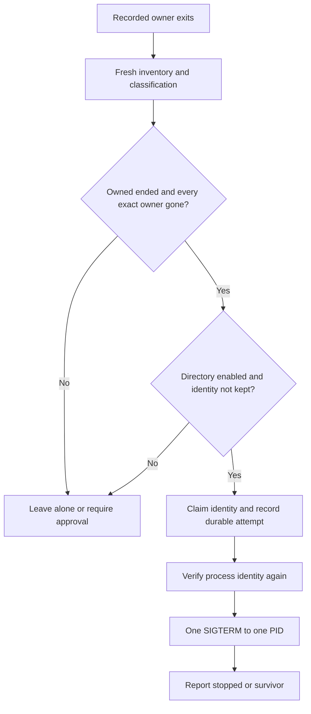

# Automatic cleanup

Automatic cleanup is an opt-in addition under development for Claude Code on Apple silicon. The published `1.0.0` binary provides manual cleanup only. The commands on this page require a build containing this feature.

A local worker survives Claude Code termination. It stops a helper only when the existing classifier freshly proves ownership by an ended Claude session, every recorded owner is gone, the human enabled the recorded directory, and the helper is not kept. Uncertain cases remain available through the manual approval flow.

## Enable one directory

Run these commands in your own foreground terminal, outside an AI agent:

```bash
agentdust setup
agentdust auto enable /absolute/path/to/project
agentdust auto status
```

The policy command describes the change and requires typing `ENABLE`. Other policy changes require typing `CONFIRM`. There is no unattended approval flag. MCP exposes no policy mutation. The CLI refuses non-interactive calls and calls with a known agent ancestor.

The selected scope is the canonical directory recorded at `SessionStart`. A session started in `/project/packages/server` needs that directory enabled separately from `/project`. There is no recursive path allowance. Symlink aliases use the same canonicalization as the hook. Existing journal evidence in an enabled directory can qualify during startup reconciliation.

Every root `SessionStart` directory recorded for that session and boot must be enabled. A resumed session that changed directories can therefore remain outside automatic scope. Enabling another directory also resumes the retained enabled directories; `pause` retains those permissions, while global `disable` clears them.

Policy stores keyed directory digests rather than project paths. `auto status` reports the number of enabled directories. To remove a directory, name it explicitly:

```bash
agentdust auto disable /absolute/path/to/project
```

The last directory removal stops and removes the worker. An unavailable directory cannot be resolved for individual removal; `agentdust auto disable` clears all directory permissions.

## Pause, resume and keep

| Command | Effect |
| --- | --- |
| `agentdust auto pause` | Stops automatic cleanup and removes the worker registration. Retains directory permissions and keeps |
| `agentdust auto resume` | Restarts cleanup for the retained directory permissions |
| `agentdust auto disable` | Stops cleanup, removes the worker registration and clears directory permissions. Retains keeps |
| `agentdust auto keep PID` | Resolves the current PID and protects that exact boot, start time and user identity from manual and automatic cleanup |
| `agentdust auto unkeep PID` | Removes stored keeps for that PID. Does not signal anything |
| `agentdust auto status` | Reads policy, worker liveness and the latest report without changing them |

A later process with the same PID does not inherit a keep. There are no executable patterns, age rules or resource thresholds in the automatic policy. Before removing the Claude hooks with `agentdust setup --remove`, run `agentdust auto disable` to remove the separately installed worker.

Manual and automatic execution acquire the same policy lock, including before the first policy file exists. Manual cleanup can create the private lock directory but does not enable policy or start a worker. Pause waits for an action already holding the policy lock. Once pause writes the disabled policy, later actions cannot start. The existing `apply = false` switch also blocks automatic signals. A disabled, unreadable or unsafe policy cannot grant automatic cleanup.

## What the worker does



The worker polls journal metadata and recorded owner liveness once per second. Proven gone identities are cached. It does not run a full inventory every second. Startup, owner-state transitions and policy changes trigger a fresh survey. Hooks do not start a survey or acquire policy locks.

Automatic execution reuses the manual executor's per-identity lock, fresh class and owner comparison, audit, identity read immediately followed by `SIGTERM`, and five-second exit check. Cross-session sharing, live owners, ambiguous ownership, suspect, likely-owned, managed and unknown classes cannot receive automatic signals. Subagents within one session must all be gone. There is no process-group signal or `SIGKILL`.

Before the signal, an automatic attempt receipt is created for the exact process identity and both the file and its directory are synced. Receipts prevent another automatic attempt after restart. A crash after receipt creation can leave an unsignaled helper requiring manual attention. This conservative failure does not cause a retry. A receipt is pruned only after its exact identity is proven gone.

The worker processes at most ten attempts per survey round and sixteen rounds per transition. A report with `pending: true` identifies work left after that budget; a later transition or a human resume triggers reconciliation. These are work bounds, not evidence that a process is abandoned.

## Results through Claude Code

The read-only `agentdust_auto_status` MCP tool returns enabled state, the apply switch, directory and keep counts, worker liveness, recent results and review items. It cannot enable, resume, broaden policy or remove keeps. The optional cleanup skill explains results and uses the existing plan/apply flow for items needing approval.

`terminated` means the exact target disappeared within the exit check. `survivor` means the signal was sent but the process remained alive. Neither triggers another automatic signal. `kept`, `skipped` and `approval_required` describe work that remains untouched. A background worker does not open an approval dialog after Claude exits. The next user interaction can review those items.

Automatic audit records use an `auto-` plan-ID prefix. Manual plan IDs retain their existing format. The audit schema is unchanged. New results contain an explicit `authorization` field. Reports retain at most 100 recent results and 100 review items, with a truncation flag. The report timestamp describes the last reconciliation, not a continuous heartbeat; `worker_running` checks the recorded worker identity live.

## Local files and limits

`automatic/` in the AgentDust data directory is private (`0700`); policy, worker identity, receipts and reports are private regular files (`0600`). Keeps and receipts store kernel identity fields, including the boot ID, but no command, environment, executable path or project path. This is separate from the unchanged manual audit format, which holds no boot ID.

The policy allows at most 128 directories and 256 keeps. The worker refuses a journal watch with more than 4,096 recorded identities. Attempt storage holds at most 16,384 outstanding receipts. Policy and report files are limited to 64 KiB. Storage failure, unsupported journal data, or unavailable ownership prevents automatic action.

The LaunchAgent is installed only after opt-in at `~/Library/LaunchAgents/com.agentdust.automatic.plist`. It runs `agentdust auto worker`, retains the selected data directory and restarts on failure with launchd throttling. The worker refuses a disabled policy and only one worker can hold its lock. Installed binary paths use the same stable Homebrew path resolution as setup.

Programs running as the same user can manipulate that user's files or signal processes directly. CLI checks and MCP permissions constrain AgentDust's supported interfaces; they do not create a security boundary against arbitrary same-user shell access.
